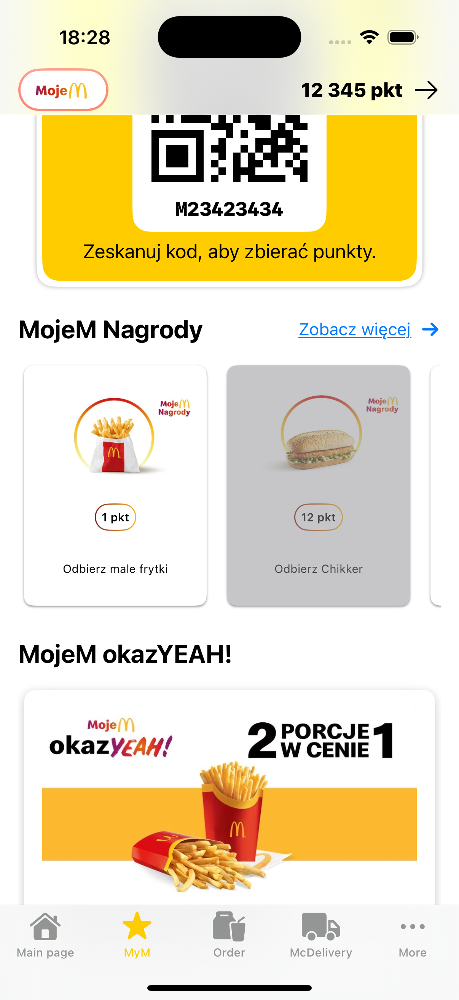

# FastFood App 🍔

FastFood App is a mobile application inspired by the McDonald's official app. It lets users explore the menu, place orders, collect rewards, and more. Designed to provide a seamless and intuitive fast-food ordering experience.
---

## Features 🚀

- **Explore the Menu**: Browse through a variety of food categories like burgers, wraps, desserts, and drinks.
- **Find Nearby Restaurants**: Locate McDonald's restaurants using a built-in map.
- **Collect Rewards**: Earn points and redeem them for exclusive deals.
- **Delivery Integration**: Order through popular platforms like Uber Eats, Wolt, Glovo, or Pyszne.pl.
- **Modern Design**: A user-friendly interface built with SwiftUI.

---

# Gallery 📸

Here are some screenshots from the app:

| Promocje                              | Punkty                              | Menu                                |
|---------------------------------------|-------------------------------------|-------------------------------------|
|  |  |  |

| Mapa                                  | Promo                               |
|---------------------------------------|-------------------------------------|
|  |  |

## Current Work and Future Plans 🚀

### Currently Working On:
- **Completing the Ordering Process**: Adding functionality to place and manage orders directly in the app.
- **Preparing Data**: Filling in missing information in the database, such as menu descriptions, item details, and rewards logic to ensure a smooth user experience.
- **Automatic Location Detection**: Enabling the app to automatically find the nearest restaurant based on your location.
- **Improved Delivery Integration**: Enhancing connections with Uber Eats, Wolt, Glovo, and Pyszne.pl for smoother delivery experiences.

### Future Features to Add:
- **Promotion Notifications**: Receive real-time notifications about the latest deals, offers, and special promotions.

