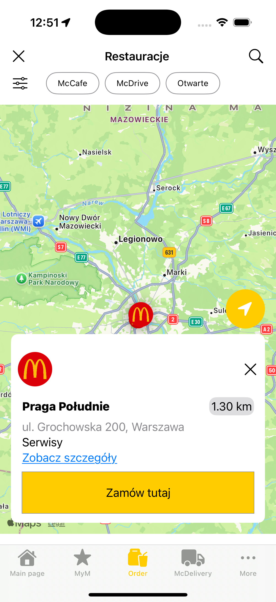
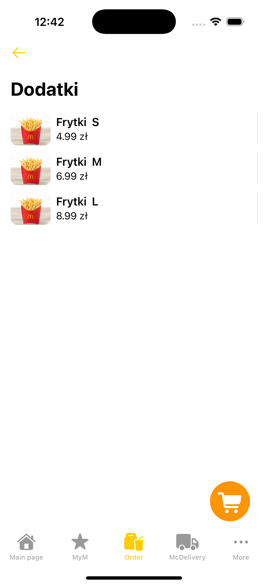
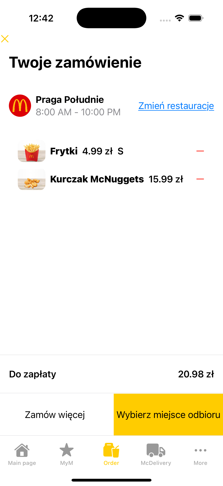

# FastFood App 🍔

FastFood App is a mobile application inspired by the McDonald's official app. It lets users explore the menu, place orders, collect rewards, and more. Designed to provide a seamless and intuitive fast-food ordering experience.
---
## Technologies Behind the App 🛠️

- **SwiftUI**
- **Firebase Firestore, Storage, Authentication**
- **MapKit**

---

## Features 🚀

- **Explore the Menu**: Browse through a variety of food categories like burgers, wraps, desserts, and drinks.
- **Find Nearby Restaurants**: Locate McDonald's restaurants using a built-in map.
- **Completing the Ordering Process**: Place and manage orders directly within the app for a seamless experience.
- **Automatic Location Detection**: Automatically find the nearest restaurant based on your current location for added convenience.
- **Collect Rewards**: Earn points and redeem them for exclusive deals.
- **Delivery Integration**: Order through popular platforms like Uber Eats, Wolt, Glovo, or Pyszne.pl.
- **Modern Design**: A user-friendly interface built with SwiftUI.

---

# Gallery 📸

Here are some screenshots from the app:

| Promocje                              | Punkty                              | Menu                                |
|---------------------------------------|-------------------------------------|-------------------------------------|
|  |  |  |

| Mapa                                  | Promo                               |Kategoria                            |
|---------------------------------------|-------------------------------------|-------------------------------------|
|  |  |  |

| Koszyk                                | Podsumowanie                        |
|---------------------------------------|-------------------------------------|
|  |  |

## Current Work and Future Plans 🚀

### Currently Working On:
- **Promotion Notifications**: Receive real-time notifications about the latest deals, offers, and special promotions.

